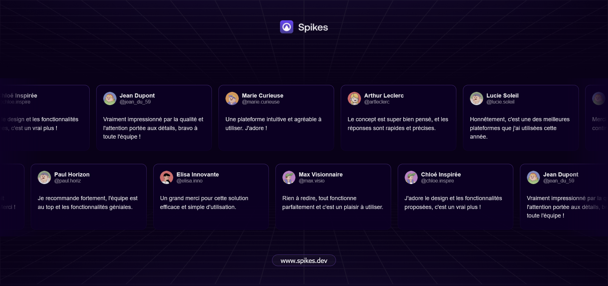

# Bienvenue sur Spikes ! 👋




# Challenge Spikes - Cartes en Animation Défilante

"Bienvenue sur Spikes" est un projet du challenge de la communauté Spikes, où l'objectif était de réaliser des cartes animées qui défilent sur un fond violet. Ce projet a été conçu comme un exercice simple, pour apprendre à concevoir des composants de **landing page** tout en mettant en pratique mes techniques d'animation et de design web avec une de mes technologies préférées : **Vue.js**.

## Description

Le projet consiste à créer un ensemble de cartes en animation défilante, qui sont présentées sur un fond violet. Chaque carte peut contenir des informations variées (texte, image, etc.), et le but est de rendre l'animation fluide.

## Objectifs

- Apprendre à designer des composants interactifs pour des landing pages avec Vue.js.
- Implémenter une animation fluide et performante des cartes avec CSS.
- Utiliser des bonnes pratiques de design et de développement front-end.
- Créer un fond violet uniforme et agréable pour contraster avec les cartes.

## Technologies utilisées

- **Vue.js** pour les composants
- **CSS3** pour le style
  
## Fonctionnalités

- **Animation des cartes** : Les cartes se déplacent horizontalement ou verticalement de manière fluide, créant un effet de défilement.
- **Composants responsives** : J'ai conçu cartes pour qu'elles soient responsives et qu'elles s'adaptent à différents écrans (desktop, tablette, mobile).
  
## Installation

1. Clonez ce repository sur votre machine :
    ```bash
    git clone https://github.com/votre-utilisateur/spikes-challenge-cards.git
    ```

2. Installez les dépendances via npm :
    ```bash
    cd spikes-challenge-cards
    npm install
    ```

3. Lancez l'application en mode développement :
    ```bash
    npm run serve
    ```

4. Ouvrez le navigateur et allez à l'URL suivante :
    ```
    http://localhost:8080
    ```

## Utilisation

- Les cartes défilent automatiquement sur la page, mais vous pouvez ajuster l'animation et les effets dans le fichiers `index.css`.
- Modifiez les contenus des cartes (texte, images, etc.) selon vos besoins dans les fichiers des composants Vue.js.

## Conclusion

Ce projet était une excellente opportunité pour expérimenter avec **Vue.js** et **CSS** afin de créer une interface interactive et animée. Grâce à ce challenge, j'ai pu approfondir mes compétences en front-end et en design d'interface.

## Contributions

Si vous avez des suggestions pour améliorer ce projet ou des idées pour de futures améliorations, n'hésitez pas à ouvrir une *issue* ou à faire une *pull request*.

## License

Ce projet est sous licence MIT. Voir le fichier [LICENSE](LICENSE) pour plus d'informations.

